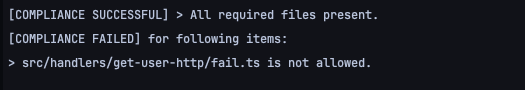

# srclint - source code consistency helper
Goal of this project is to keep consistent and concise codebase spread across many repositories. 

Philosophy:
1. Define required files (such as dependency locks, test runner configs, etc)
2. Define shape of source code by convenient yaml notation
3. Ignore directories that hold no value for consistency (docs, assets, misc)
4. Run in CI/CD to make sure your changes comply with expected standard

**When binary is executed it should produce output similar to the following**



___

## How to use
```shell
srclint .
```

## How it works:
Each directory needs to have config file in working directory for the program. Basic config looks like this:
```yaml
version: 1
required:
  - "srclint.yml"
structure:
  - "src/**" 
ignore:
  - ".idea"
```


### Error Codes
1. Missing required file
2. Source code structure failed validation